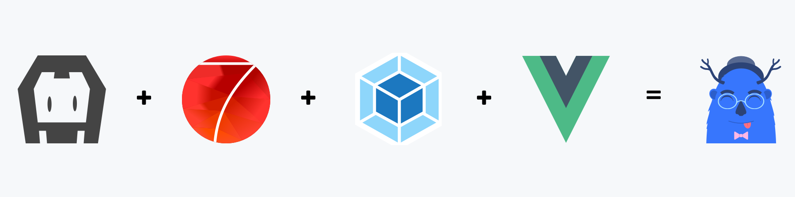

# Architecture-N-Tiers-Front

This project uses:
* [Framework7 5](https://framework7.io)
* [Vue 2](https://vuejs.org/)
* [Vuex](https://github.com/vuejs/vuex)
* [Webpack 4](https://webpack.github.io/)
* [Cordova](https://cordova.apache.org/)
* [FontAwesome 5](http://fontawesome.io/)
* [Babel Loader 7](https://github.com/babel/babel-loader)
* [Axios](https://github.com/axios/axios)

## Minimum Requirements
* **Cordova:** _6.0.0_
* **Node.js:** _6.5.0_ (Supports ES6)

## Installation
- Clone repository : `git clone https://github.com/ValentinMoreau08/Architecture-N-Tiers-Front.git`
- Navigate into template cloned folder : `cd Architecture-N-Tiers-Front`
- Use latest branch : `git checkout main`
- Install with npm : `npm install`

  
## Start
#### WEB
* Inside Architecture-N-Tiers-Front use command : `cordova run browser -- --live-reload`
#### Mobile (Android)
* Connect your android phone to your computer
* Run command `adb reverse tcp:8180 tcp:8180` so that you can access your api from your localhost:8180 
* Inside Architecture-N-Tiers-Front use command : `cordova run android`
* Note: You can also find the apk in the root of the project
**Requirements:** _You are going to need JDK8 to run the android version, cordova does not support other JDK version.

## Composition

#### Vue
- You can find all vue pages in here :  [Vues](src/assets/vue/pages) 
- There are 3 folders : 
  * Admin folder
  * User folder
  * Manager folder
- You can also find the vue pages that are common to some roles in the root of vue/pages folder.

#### Routes
All the routes are specified in [route.js](src/routes.js)

## Platforms
#### Existing platforms
* **Add Browser:** `cordova platform add browser`
* **Add Android:** `cordova platform add android`
#### Available platforms to add
* **Add Ios:** `cordova platform add ios`
#### Remove unwanted paltform
* `cordova platform remeve "platform_name"`

